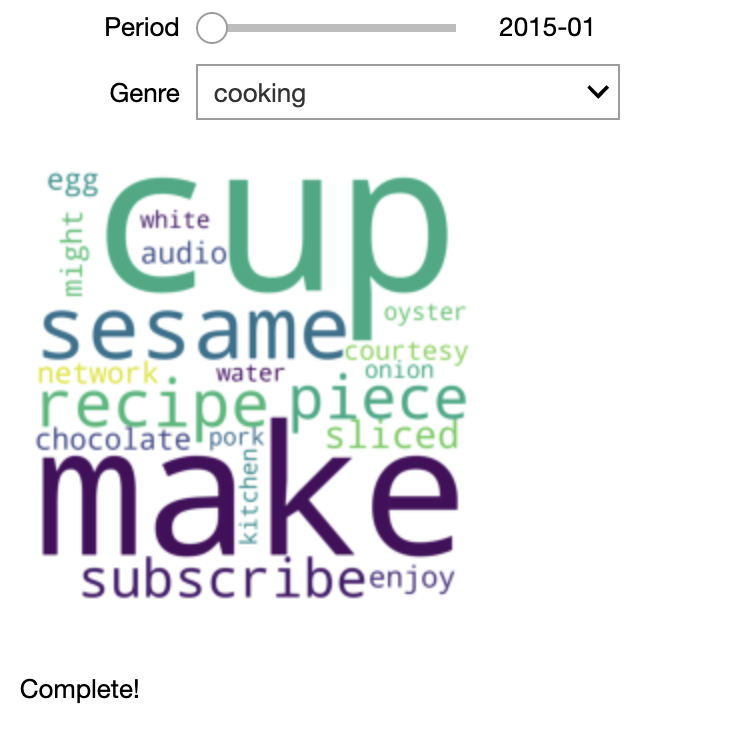
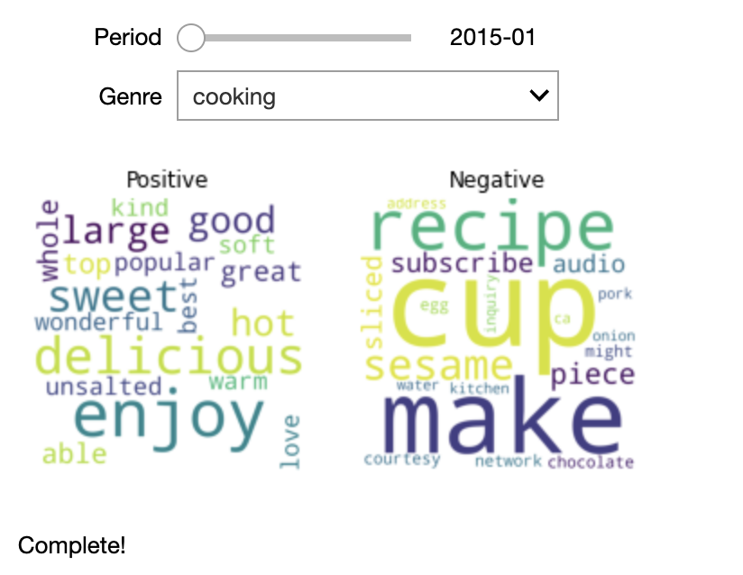
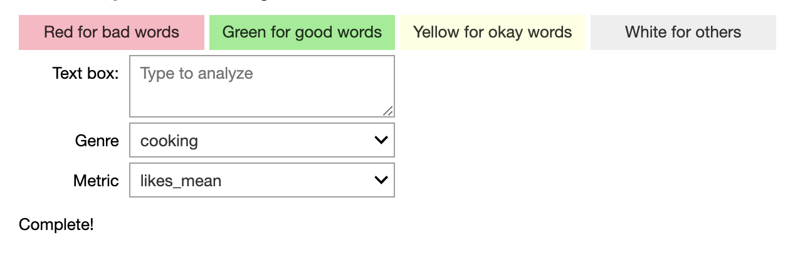

Welcome to ECE 229 Project 7's documentation!
=============================================

==================================
YOUTUBE CONTENT CREATOR DASHBOARDS
==================================

Intallation and Setup
---------------------
This code was run using Python 3.6.6 and is configured for using the Chrome browser. Alternate configurations are not guaranteed to work.

The following pacakages are required for scraping data, analyzing the data, and displaying the results:

**Webscraping**

* beautifulsoup4
* selenium (Then download the driver and follow further instructions from `here <https://selenium-python.readthedocs.io/installation.html>`_.)
* requests

**Analysis**

* textblob (Download the corpora after installing the package with :code:`python -m textblob.download_corpora`)
* statistics

**Displaying Results**

* ipywidgets
* wordcloud
* matplotlib

**Common to All**

* pickle
* os
* pandas
* datetime
* sys
* time
* numpy

User Guide
----------
**Running the code**

*Scraping*

1. Make sure :code:`scraping/users.txt` is up to date with desired user list. Each line in the user list must be in the format "Genre type user". 'Genre' is the family or type of user content (analysis is grouped by this genre!!), such as cooking or gaming.  'Type' can be 'u' for user, 'p' for playlist or 'c' for channel. 'User' is the username the content creator uploads to YouTube under.

2. Run :code:`scraping/run_get_video_links` to get links to 100+ videos for all the users in :code:`scraping/users.txt`. This code creates one folder per genre in :code:`data/source_links` and in each genre-folder creates one text file per user.

3. Run :code:`scraping/run_get_video_data` to get the meta data for each video link. The script automatically finds all folders and in :code:`data/source_links` and scrapes each video linked in the text files.

*Sentiment Analysis - UPDATE*

1. Make sure that all the scraped data is stored as a :code:`.txt` file with the format :code:`<name>_dataFrame.txt` in the :code:`data/` directory.
2. Run :code:`analysis_backend/generate_DF` to process all such files simultaneously from a given directory (default: :code:`data/`) and into a pickled dictionary of dataframes, each of which is indexed with a key described by the corresponding :code:`<name>`. This program cleans the data, controls the duplicates and removes the garbage elements. It also looks at the distributions of their various attributes across a genre.
3. Run :code:`analysis_backend/analyze_text` to analyze a given piece of text based on the dataframes generated using :code:`generate_DF` to produce a colour coded output as well as an overall score.

*Visualisations - UPDATE*

1. Install package :code:'wordcloud'.

2. Make sure you have :code:'data_combined.p' inside the :code:'data' folder.

3. Open :code:'front_end/front-end_Group7-Copy1.ipynb' and run the code. You will get the interactive output.

Table of Contents
-----------------

.. toctree::
   :maxdepth: 3
   
   backend
   frontend

Indices and tables
------------------

* :ref:`genindex`
* :ref:`modindex`
* :ref:`search`
